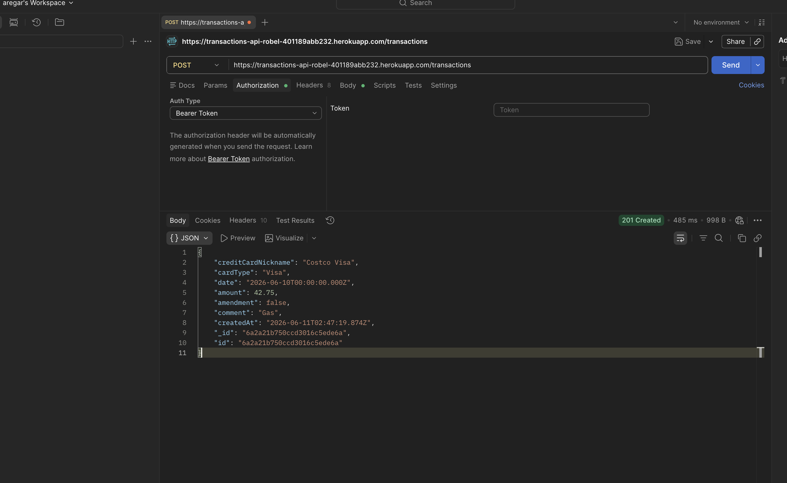
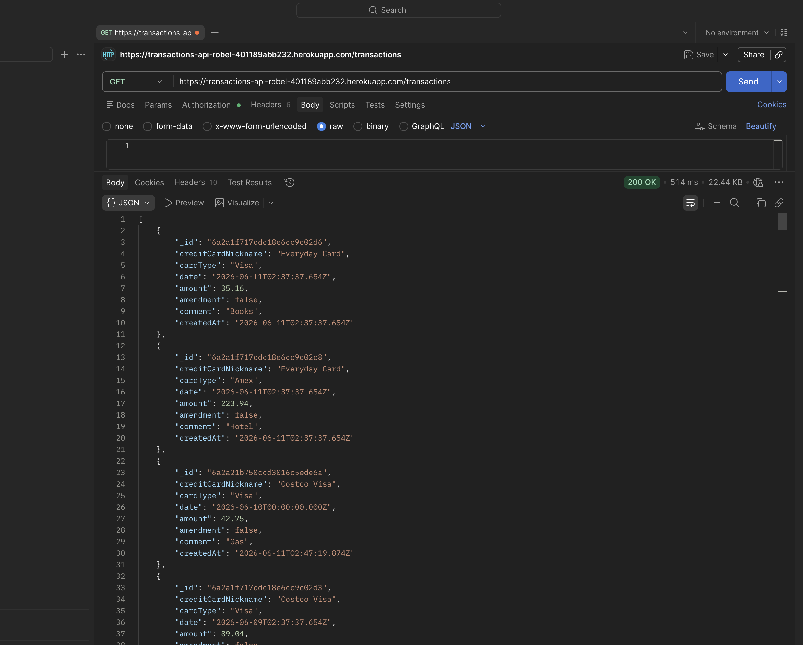
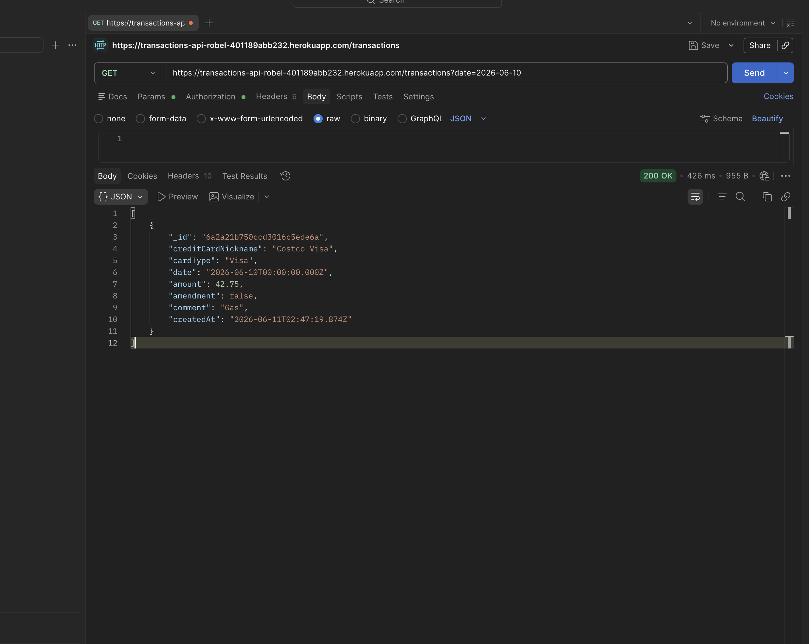
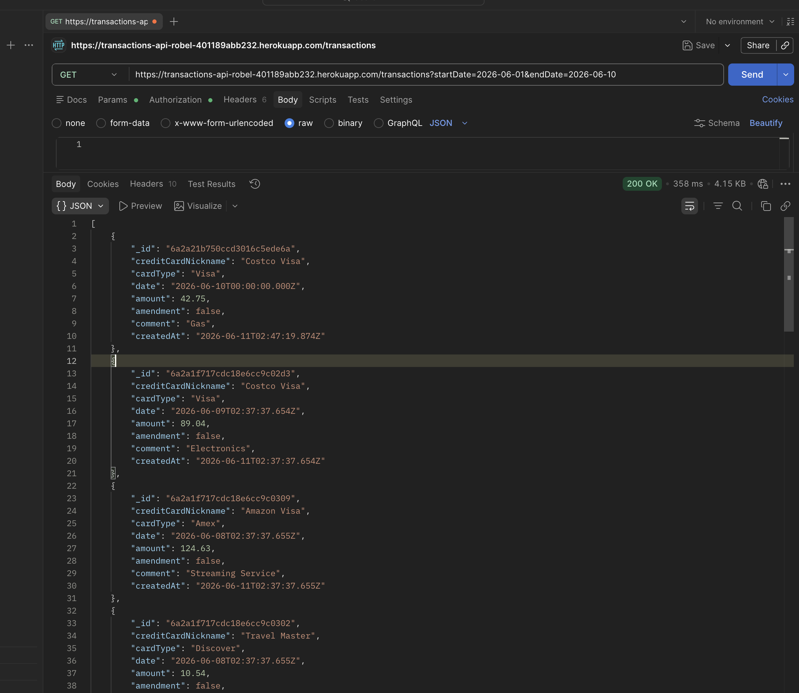
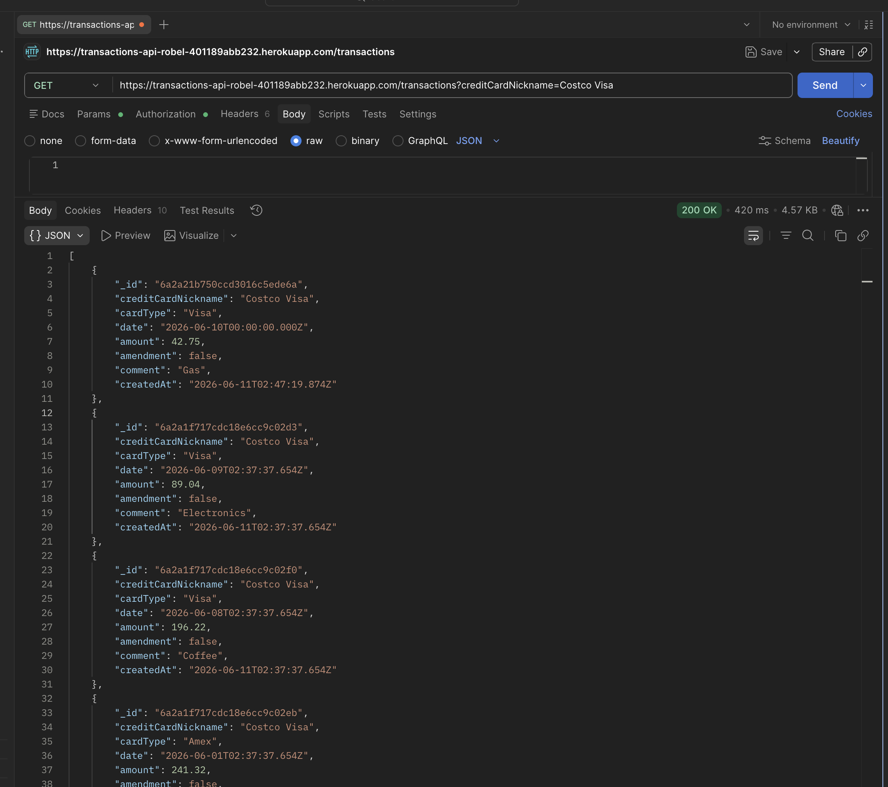
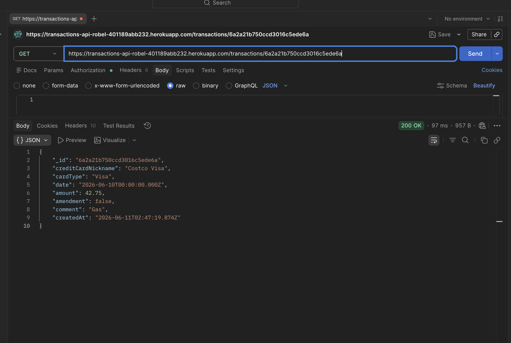

# Transactions API

**Live App:** https://transactions-api-robel-401189abb232.herokuapp.com/

## Description

A REST API for storing credit card transactions built with Node.js, Express, and MongoDB, deployed on Heroku with MongoDB Atlas.

Transactions follow an append-only design — they are never edited or deleted. Corrections are made using amendment transactions.

## Data Model

```json
{
  "creditCardNickname": "Costco Visa",
  "cardType": "Visa",
  "date": "2026-05-12",
  "amount": 42.75,
  "amendment": false,
  "comment": "Gas"
}
```

## Supported Card Types
- Visa
- Master
- Amex
- Discover
- Other

## API Endpoints

| Method | Route | Description |
|--------|-------|-------------|
| GET | / | Health check |
| POST | /transactions | Create a transaction |
| GET | /transactions | Get all transactions |
| GET | /transactions?date=YYYY-MM-DD | Filter by date |
| GET | /transactions?startDate=YYYY-MM-DD&endDate=YYYY-MM-DD | Filter by date range |
| GET | /transactions?creditCardNickname=Costco Visa | Filter by card nickname |
| GET | /transactions/:id | Get transaction by ID |

## How to Run Locally

```bash
git clone https://github.com/RobelArega123/Transactions-Api.git
cd Transactions-Api
npm install
node seed.js
node server.js
```

## Seed the Database

```bash
node seed.js
```

Inserts 100 random transactions into the database.

## Questions

**What were the new things you learned in this activity?**
I learned how to deploy a Node.js application to Heroku and connect it to a cloud MongoDB database using MongoDB Atlas. I also learned how to set environment variables in Heroku using the CLI, and how append-only API design works for financial systems where data integrity is critical.

**What is the purpose of the seed.js program?**
seed.js pre-populates the database with 100 random transactions so the API has data to work with right away. It generates realistic test data with different card types, nicknames, amounts, and dates spread over the last 90 days.

**What was the most difficult thing to do in this activity?**
The most difficult part was the deployment process — connecting the local Dev Container setup to Heroku and making sure the environment variables were configured correctly so the app could connect to MongoDB Atlas instead of the local Docker MongoDB instance.

**How would you say you were prudent in this assignment?**
I was careful to keep sensitive credentials like the MongoDB connection string out of the source code by using environment variables and the .env file. I also made sure the .gitignore excluded node_modules and .env from being pushed to GitHub.

**How would you need to be prudent when developing this kind of web application?**
Financial APIs require extra care around data integrity. Since transactions should never be deleted or modified, the append-only design is essential. I would also add authentication, rate limiting, and input validation to prevent abuse in a production environment.

## Screenshots

## Screenshots

### POST /transactions


### GET /transactions (all)


### GET /transactions?date=2026-06-10


### GET /transactions?startDate=2026-06-01&endDate=2026-06-10


### GET /transactions?creditCardNickname=Costco Visa


### GET /transactions/:id
